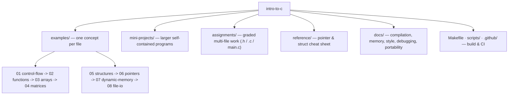

<div align="center">

```
   ██████╗    ██╗      █████╗ ███╗   ██╗ ██████╗
  ██╔════╝    ██║     ██╔══██╗████╗  ██║██╔════╝
  ██║         ██║     ███████║██╔██╗ ██║██║  ███╗
  ██║         ██║     ██╔══██║██║╚██╗██║██║   ██║
  ╚██████╗    ███████╗██║  ██║██║ ╚████║╚██████╔╝
   ╚═════╝    ╚══════╝╚═╝  ╚═╝╚═╝  ╚═══╝ ╚═════╝
        Introduction to Programming in C
```

**A cleaned-up, reviewed record of my introductory C coursework — from control flow to pointers, dynamic memory, and file I/O.**


</div>

> [!NOTE]
> **This is a learning archive, not a library.** The programs come from a university
> *Introduction to Programming* course and reflect that level. What earns your attention here is
> not the difficulty of the C — it's the care taken *around* the code: every file is reviewed,
> compiles warning-clean in CI, is consistently formatted, and is documented. Genuine bugs found
> while organising it were fixed and recorded in [`docs/CODE_REVIEW.md`](docs/CODE_REVIEW.md).

---

<!--
  SUBHAM — WRITE THIS "ABOUT" PARAGRAPH YOURSELF.
  Per our standing rule, the personal voice is yours, not mine. A short, honest paragraph:
  what this repo is, that you wrote it while learning C and later refactored it for quality,
  and one true sentence about where you are now (moving into Python / backend). Then delete
  this comment.
-->

## Contents

- [Why this repository exists](#why-this-repository-exists)
- [Learning objectives](#learning-objectives)
- [Highlights](#highlights)
- [Repository architecture](#repository-architecture)
- [Concepts & techniques covered](#concepts--techniques-covered)
- [At a glance](#at-a-glance)
- [Getting started](#getting-started)
- [Running the programs](#running-the-programs)
- [Suggested study order](#suggested-study-order)
- [What the refactor changed](#what-the-refactor-changed)
- [FAQ](#faq)
- [Documentation](#documentation)
- [References](#references)
- [License & contact](#license--contact)

## Why this repository exists

These are the C programs I wrote for my B.Sc. Computer Science *Introduction to Programming*
course. After finishing the course I revisited the work, reviewed every file, fixed the real
defects, organised it by topic, and documented it — both as a durable personal reference and as
an honest sample of foundational work. It is **not** presented as production software or as
advanced C.

## Learning objectives

The programs collectively cover the core of procedural C:

- 🔁 Control flow — conditionals, loops, `switch`, and pattern generation
- 🧩 Functions — parameters, return values, decomposition
- 🗂️ Arrays and matrices — iteration, searching, 2-D data
- 🏗️ Structures — `struct`, `typedef`, nested and arrayed records
- 🎯 Pointers — `&`/`*`, `->` vs `.`, pointer arithmetic
- 🧠 Dynamic memory — `malloc`/`free` with NULL-checking and clear ownership
- 📄 File I/O — reading and writing text files
- 🛠️ Multi-file programs — headers, implementation units, and a build

## Highlights

| | |
|---|---|
| ✅ **Compiles clean in CI** | GitHub Actions builds and warning-checks every file with `gcc -Wall -Wextra` on each push |
| 🔍 **Reviewed, not just dumped** | Nine real defects fixed and documented; see [`docs/CODE_REVIEW.md`](docs/CODE_REVIEW.md) |
| 🎨 **Consistent formatting** | Enforced by [`.clang-format`](.clang-format) — `make format` conforms any file |
| 📚 **Documented** | A [`docs/`](docs) set covering compilation, memory, style, debugging, and portability |
| 🧱 **Sensibly organised** | Examples, mini-projects, and assignments separated by purpose |
| 🤝 **Honest** | No inflated claims, no borrowed code, no republished course material |

## Repository architecture



<details>
<summary><b>Full folder tree</b></summary>

```
intro-to-c/
├── examples/
│   ├── 01-control-flow/     # if/else, switch, while, for, break, patterns
│   ├── 02-functions/        # functions, prime check
│   ├── 03-arrays/           # 1-D arrays, linear search
│   ├── 04-matrices/         # 2-D arrays, matrix add/multiply
│   ├── 05-structures/       # struct, typedef, arrays of structs
│   ├── 06-pointers/         # pointers with structs
│   ├── 07-dynamic-memory/   # malloc-based arrays and structs
│   ├── 08-file-io/          # fgets, file read/write (+ sample data)
│   └── README.md
├── mini-projects/
│   ├── planet-habitability/ # menu-driven struct records program
│   ├── grocery-inventory/   # dynamic array of item structs
│   └── README.md
├── assignments/
│   ├── digit-frequency/     # count a digit's occurrences (.h/.c/main.c)
│   ├── grade-report/
│   ├── array-rotation/
│   └── README.md
├── reference/
│   ├── pointer_struct_cheatsheet.c
│   └── README.md
├── docs/
│   ├── COMPILATION.md   MEMORY_MANAGEMENT.md   STYLE_GUIDE.md
│   ├── DEBUGGING_GUIDE.md   PORTABILITY.md   CODE_REVIEW.md
│   └── LEARNING_NOTES.md
├── assets/                  # image placeholders
├── scripts/check.sh         # compile-check used locally and by CI
├── .github/workflows/build.yml
├── Makefile
├── .clang-format
├── .editorconfig
├── .gitignore
└── LICENSE
```

</details>

## Concepts & techniques covered

<details open>
<summary><b>C language concepts</b></summary>

| Concept | Where |
|---------|-------|
| Conditionals, loops, `switch`, `break` | `examples/01-control-flow` |
| Functions, parameters, return values | `examples/02-functions` |
| 1-D arrays, `sizeof`-based iteration, linear search | `examples/03-arrays` |
| 2-D arrays, matrix addition & multiplication | `examples/04-matrices` |
| `struct`, nested structs, `typedef`, arrays of structs, function-pointer typedefs | `examples/05-structures`, `examples/08-file-io` |
| Pointers, `&`/`*`, `->` vs `.`, pointer arithmetic | `examples/06-pointers`, `reference/` |
| Dynamic allocation with `malloc`/`free` | `examples/07-dynamic-memory`, `mini-projects/grocery-inventory` |
| File handling with `fgets`/`fputs` | `examples/08-file-io` |
| Multi-file programs with headers | `assignments/` |

</details>

<details>
<summary><b>Techniques & algorithms</b></summary>

| Technique | Where |
|-----------|-------|
| Linear search | `examples/03-arrays/linear_search.c` |
| Selection sort over structs | `mini-projects/planet-habitability` |
| Prime checking by trial division | `examples/02-functions/prime_check.c` |
| Substring search (`strstr`) | `examples/08-file-io`, `mini-projects/planet-habitability` |
| Digit extraction (`% 10`, `/ 10`) | `assignments/digit-frequency` |
| Pass-by-reference via pointers | `examples/07-dynamic-memory/dynamic_array_passbyref.c` |

</details>

Memory handling is covered in depth — with a diagram and the exact patterns used — in
[`docs/MEMORY_MANAGEMENT.md`](docs/MEMORY_MANAGEMENT.md).

## At a glance

| | |
|---|---|
| **Language** | C (C11), standard library only |
| **Scope** | 8 topic areas · 2 mini-projects · 3 assignments |
| **Build** | `make` (GCC or Clang); verified in GitHub Actions |
| **Formatting** | `.clang-format` (Allman, 4-space) |
| **Dependencies** | None |
| **License** | MIT |

## Getting started

```bash
git clone https://github.com/subham-hq/intro-to-c.git
cd intro-to-c

make            # build every program into build/
make check      # compile-check everything with warnings
make clean      # remove build artifacts
```

Or compile one program directly:

```bash
gcc -Wall -Wextra -std=c11 examples/03-arrays/linear_search.c -o linear_search
./linear_search
```

Full details, including the file-I/O and multi-file cases, are in
[`docs/COMPILATION.md`](docs/COMPILATION.md).

## Running the programs

Real output from a few of the programs (input shown in the caption):

<details open>
<summary><b><code>examples/02-functions/prime_check.c</code></b> — input: <code>29</code></summary>

```
Enter a number: 29 is a prime number.
```

</details>

<details>
<summary><b><code>examples/03-arrays/linear_search.c</code></b> — input: <code>1..10</code>, search <code>7</code></summary>

```
Enter elements to be included in the array:
Enter the search element: Element found at 6 location.
```

</details>

<details>
<summary><b><code>assignments/digit-frequency</code></b> — input: <code>122353</code>, digit <code>3</code></summary>

```
Enter a number:
Enter digit to be checked:
The frequency of the digit 3 in 122353 is: 2
```

</details>

<details>
<summary><b><code>mini-projects/planet-habitability</code></b> — 2 planets, then menu option 1</summary>

```
MENU
1. Find and print all habitable planets
2. Search by oxygen and carbon dioxide levels
3. Search by keyword in planet names
4. Exit
Habitable planets (sorted by distance from Earth):
Kepler - 4.20 light-years
```

</details>

> 📷 Screenshots can be added under [`assets/`](assets) and linked here — see that folder's README.

## Suggested study order

If you're using this to learn, this order matches how the concepts build:

1. `examples/01-control-flow`
2. `examples/02-functions`
3. `examples/03-arrays` -> `examples/04-matrices`
4. `examples/05-structures`
5. `examples/06-pointers` (keep `reference/pointer_struct_cheatsheet.c` open alongside)
6. `examples/07-dynamic-memory`
7. `examples/08-file-io`
8. `mini-projects/` and `assignments/` to see the pieces combined

## What the refactor changed

The code is the coursework as written; the refactor improved everything around it and fixed
genuine defects without changing intent:

- Fixed **9 real bugs** — uninitialised reads, an out-of-bounds loop, wrong `scanf` specifiers,
  missing `malloc`/`fopen` checks, missing `free`, an integer-division logic bug, and a
  mislabelled comparison. Full table in [`docs/CODE_REVIEW.md`](docs/CODE_REVIEW.md).
- Removed committed binaries, `.DS_Store`, and an embedded `.git`; added a proper `.gitignore`.
- Applied consistent formatting via `.clang-format`.
- Added a Makefile, a compile-check script, and CI.
- Organised files by purpose and documented them.

**Bug classes caught** (the classic beginner traps): uninitialised reads · off-by-one indexing ·
format-specifier mismatches · unchecked `malloc`/`fopen` · missing `free` · integer vs.
floating-point division.

<!-- SUBHAM: if you want, add a line here on which of these you actually remember hitting — see docs/LEARNING_NOTES.md -->

## FAQ

<details>
<summary><b>Is this advanced C?</b></summary>

No, and it doesn't claim to be. It's introductory coursework. The value on display is engineering
discipline — review, testing, formatting, CI, documentation — applied to foundational code.
</details>

<details>
<summary><b>Why does <code>main.c</code> in the assignments <code>#include</code> a <code>.c</code> file?</b></summary>

That's the convention the course's auto-grader required. It's an anti-pattern in real projects
(you'd compile and link separate objects instead), and it's kept as submitted for authenticity.
See [`docs/CODE_REVIEW.md`](docs/CODE_REVIEW.md) and [`docs/COMPILATION.md`](docs/COMPILATION.md).
</details>

<details>
<summary><b>Are the course problem statements included?</b></summary>

No. Those are the course provider's material. Tasks are described in my own words in the relevant
folder READMEs.
</details>

## Future improvements

Honest, concrete next steps if this were taken further:

- Bound `scanf` string widths (`%49s`) or switch to `fgets` for input safety.
- Convert the assignments to proper separate-compilation with linked object files.
- Add a small test harness that feeds sample input and checks output.
- Add `-fsanitize=address,undefined` runs to CI for the dynamic-memory programs.

<!-- SUBHAM: your own "what I'd do differently" reflection belongs in docs/LEARNING_NOTES.md -->

## Documentation

| Document | Contents |
|----------|----------|
| [`docs/COMPILATION.md`](docs/COMPILATION.md) | Building and running everything |
| [`docs/MEMORY_MANAGEMENT.md`](docs/MEMORY_MANAGEMENT.md) | `malloc`/`free` patterns used here, with a diagram |
| [`docs/STYLE_GUIDE.md`](docs/STYLE_GUIDE.md) | Conventions enforced by `.clang-format` |
| [`docs/DEBUGGING_GUIDE.md`](docs/DEBUGGING_GUIDE.md) | Warnings, sanitizers, `gdb`, checklists |
| [`docs/PORTABILITY.md`](docs/PORTABILITY.md) | What's portable and the details that matter |
| [`docs/CODE_REVIEW.md`](docs/CODE_REVIEW.md) | Every fix made and everything left as written |
| [`docs/LEARNING_NOTES.md`](docs/LEARNING_NOTES.md) | Personal reflections (template) |

## References

- *The C Programming Language* — Kernighan & Ritchie
- [cppreference — C](https://en.cppreference.com/w/c)
- [GNU GCC documentation](https://gcc.gnu.org/onlinedocs/)
- Course: B.Sc. Computer Science, *Introduction to Programming*

## License & contact

Released under the [MIT License](LICENSE) © 2026 Subham.

**GitHub:** [@subham-hq](https://github.com/subham-hq)
