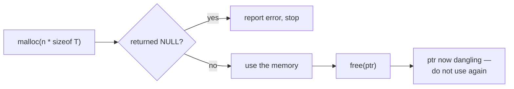

# Memory Management

This note explains the dynamic-memory patterns used in the repository. The relevant programs are:

- `examples/07-dynamic-memory/dynamic_array.c`
- `examples/07-dynamic-memory/dynamic_array_passbyref.c`
- `examples/07-dynamic-memory/dynamic_array_pointers.c`
- `examples/07-dynamic-memory/dynamic_structs.c`
- `mini-projects/grocery-inventory/grocery_inventory.c`

## The rule

Every `malloc` has exactly one matching `free`, and the result of `malloc` is checked before use.
Both of those were **added during the code review** — the original coursework versions omitted them,
which is the single most common memory mistake beginners make.

## The lifecycle



## The pattern used in this repo

```c
struct stud *arr = malloc(sizeof(struct stud) * n);
if (arr == NULL)          /* malloc can fail */
{
    printf("Memory allocation failed.\n");
    return 1;             /* do not dereference a NULL pointer */
}

/* ... use arr[0..n-1] ... */

free(arr);               /* release exactly once */
```

## Things to remember

| Concern | Guidance |
|---------|----------|
| Allocation size | Use `sizeof *ptr` or `sizeof(Type)` multiplied by the count — never a hard-coded byte figure. |
| Failure | `malloc` returns `NULL` when it cannot allocate. Always check. |
| Ownership | Whoever `malloc`s is responsible for the matching `free`. In `grocery_inventory.c` the allocation happens in `readGroceryList()` and is freed by `main()` — the ownership transfer is deliberate. |
| Double free / use-after-free | After `free(ptr)`, the pointer is dangling. Do not read, write, or free it again. |
| Leaks | A `malloc` with no reachable `free` is a leak. Run under a leak checker (see the Debugging Guide). |

## Verifying with a sanitiser

```bash
gcc -g -fsanitize=address,undefined examples/07-dynamic-memory/dynamic_structs.c -o ds
echo "1 CS 8.1  2 EE 9.4  3 ME 7.2  4 CS 9.9  5 EC 8.8 6 CS 6.5 7 CE 9.1 8 CS 7.7 9 EE 8.2 10 ME 9.6" | ./ds
```

AddressSanitizer will report any out-of-bounds access, use-after-free, or leak at run time. A
clean run is a good (though not exhaustive) sign the memory handling is correct.
